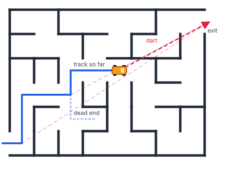

# A⭐ (a-star)

Agentic coding harness for complex domains: a cheap agent finds the route to the goal end-to-end, then each change lands small and simple enough for a human to review and put down.

If you're not familiar with the A\* path-finding algorithm, imagine driving a car through a high-walled maze, trying to find the shortest path to the exit.
(If you are familiar with it, please allow me some artistic license in the following description!)

You can fire a dart at the exit, over the walls, and know how far away it is.
Once you've fired the dart, though, you have to obey the walls when you drive.
So you drive a little, fire another dart, and repeat.
Hopefully you're closer! If not, you adapt your path — you might even backtrack — but you make another small decision, then measure again.



**A⭐ is that process applied to agentic coding.**

1. **Dart** to an end-to-end as quickly as possible.
   A cheap sub-agent reaches the goal ignoring the project's usual rules, the way the dart ignores the walls; its code never lands.
2. **Drive**: use what the dart found to land atomic, comprehensible, correct, compliant changes.
   A drive obeys the walls — the project's coding standards, tests and review — and each change it lands is a real step along the route.
3. **Go to 1** from wherever the work has got to.
   The distance a dart still has to cover — its diff against the base — shrinks as the work converges, and the card is done when nothing is left between the base and the goal.

A **card** is the unit of work: an issue in the project's tracker, or whatever the project calls one.
Changes are split per Kent Beck's *Tidy First?* — a **tidy** changes structure, an **advance** changes behaviour, and the two never share a commit.
A **drive** lands either one.

## Why

A⭐ aims to solve the following problems, and optimises for sustainability — what the human has to hold in their head, and how many decisions they make per hour — not throughput.

- **The human's context is now the scarce resource.**
  Writing the code was never the hard part; most of an engineer's work is now the thinking — the analysis, the judgement — and working alongside AI makes that thinking more taxing, not less, especially in naturally complex domains.

  - **Agentic coding has made reviewing exhausting.**
    An agent hands you in minutes a change that would have taken a person days.

    On a project where the domain itself is complex, you can't just wave it through: before you can have confidence that it's correct and maintainable, you have to build the mental model in your head — every concern it touches, and how each one meets the rest of the system.

    You can't do much about the essential complexity — that's the domain's, and it's why you're needed.
    A⭐ goes after the incidental complexity piled on top of it: concerns braided together, structure and behaviour in one diff, workarounds an agent left behind — so each change is small and simple enough to confirm, then put down.

  - **Each increment is optimised for simplicity: "obviously no bugs", rather than "no obvious bugs".**
    [Hoare's distinction](https://en.wikiquote.org/wiki/C._A._R._Hoare) — a design so simple there are obviously no deficiencies, against one so complicated there are no obvious deficiencies.
    Confirming the first is a check the human finishes; the second they carry on holding, since they can't know when they've looked hard enough.

    - **Simple, not easy** — Rich Hickey's distinction, from [*Simple Made Easy*](https://www.infoq.com/presentations/Simple-Made-Easy/).
      Simple is un-braided: one concern per piece, so a reviewer can confirm each on its own.
      Easy is near to hand, and the near-to-hand change usually braids a new concern into an existing one, leaving the reviewer to hold both at once.

    - **Tidy First makes each increment independently reasonable.**
      A human can understand a smaller part of the change in isolation, then page it out of their working memory to focus on the next.
      A tidy is reviewed by asking only *could this change anything?*; an advance, made on a structure already tidied for it, is small enough to hold whole.

- **The route should come from evidence, not from reading.**
  Many agent harnesses plan the whole change from the code as it reads, then execute the plan; decades of agile practice say the route is found by building, in small steps, with feedback from each.

- **Darting is now cheap.**
  A dart agent on a cheaper model reaches an end-to-end in minutes, for a fraction of what the main session costs, so throwing a dart away and throwing another is affordable in a way it never was when a person wrote it.
  The sub-goals are what the dart found, rather than what was guessed before it.

## What A⭐ does, and what it doesn't

**A⭐ owns the dart/drive loop, and nothing else.**

- **It does:**
  - check a card is ready to dart, and agree what it's for with you where it isn't;
  - dart to the goal with a cheap sub-agent, and turn what the dart found into sub-goals;
  - drive each sub-goal to landing as one tidy or one advance, and keep the two apart;
  - choose the next step from the ready sub-goals;
  - adjust to whether you're watching the session (primary or secondary).

- **It doesn't, and leaves to your project's conventions:**
  - picking a card up and putting it down, and the tracker;
  - planning, and where sub-goals, decisions and open questions are recorded;
  - coding standards, and the definition of done;
  - ship/show/ask, and code review;
  - writing commit messages, PR descriptions and issue updates.

- **Three choices are A⭐'s own, and your project answers them**: how a tidy lands, how an advance lands, and branch cleanup.
  Where it doesn't answer one, A⭐ asks rather than guessing.

## Usage

- `/a-star <card>` — start or resume the loop on a card, once your project's conventions have picked it up
- `/a-star:dart` — reach the goal end-to-end, and break the card into sub-goals
- `/a-star:drive <sub-goal>` — land one sub-goal to the project's standards: a tidy, interrupting the work in hand if need be, or an advance
- `/a-star:primary`, `/a-star:secondary` — say whether you're watching this session; it starts primary

## Setup

```
/plugin install a-star@juxt-plugins
```

## Recommended alongside

[chalk](../chalk/) writes the commit messages, PR descriptions and issue updates A⭐'s work produces, for the colleague who wasn't there, and its `pick-up` records the sub-goals and decisions A⭐ asks for in the session's plan.
A⭐ names neither; it works with whatever your project's conventions load.
